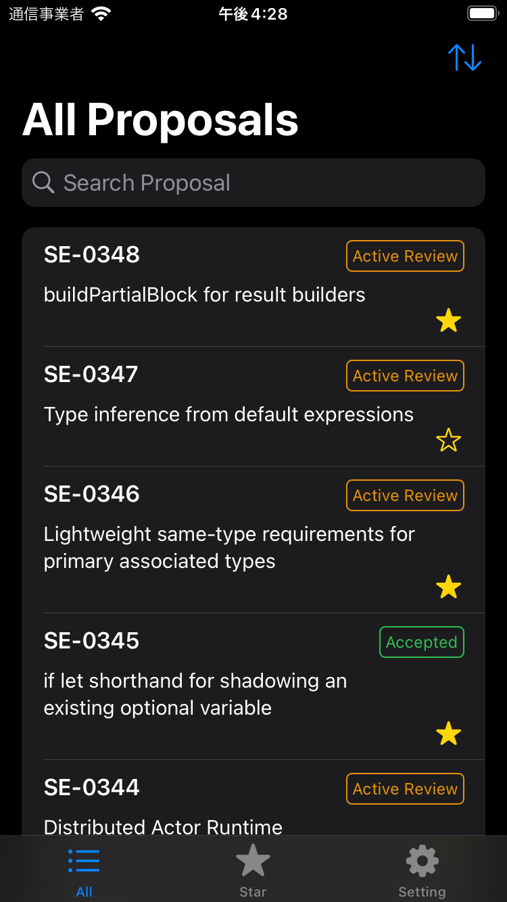
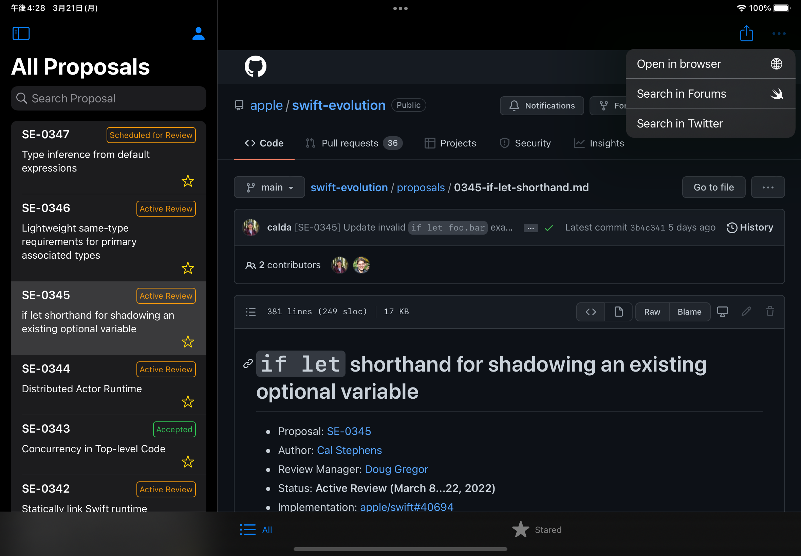
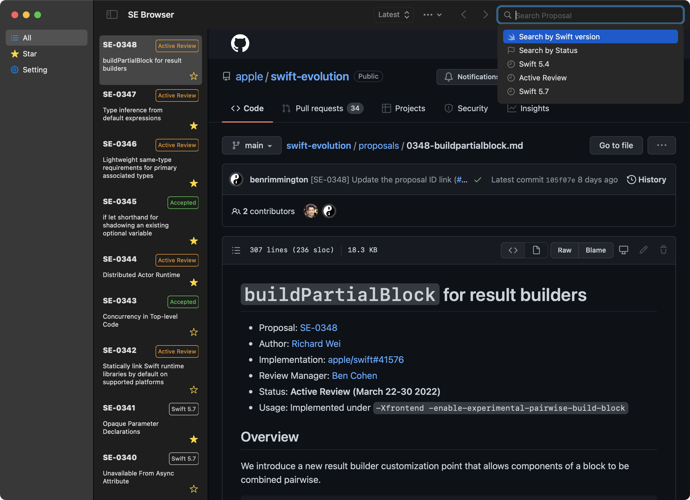

# Swift Evolution Browser

The Swift Proposal Browswer that build with SwiftUI. (**beta** currently)

|iOS|iPad|macOS|
|--|--|--|
||||

## Requirements

- Xcode 13.3 (RC)
- macOS Monterey

## Setup

```bash
make setup # Install required tools for development
```

## Links

[Effective SwiftUI 候補（仮説）](https://zenn.dev/tobi462/scraps/905f2e6ac9b895)

## Author

Yusuke Hosonuma / [@tobi462](https://twitter.com/tobi462)
