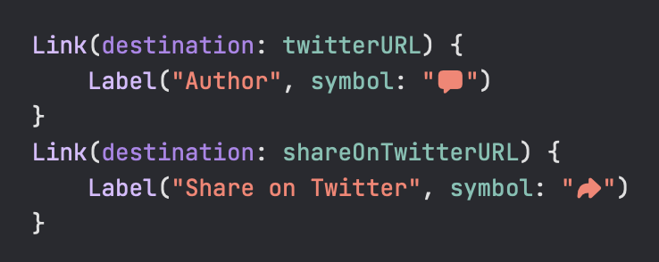

# Swift Evolution Browser

The Swift Proposal Browser that build with SwiftUI.

|iOS|iPad|
|--|--|
|||

|macOS|
|--|
||

## Feature
- Pure SwiftUI (not use [The Composable Architecture](https://github.com/pointfreeco/swift-composable-architecture))
- Multi-platform (iOS / iPad / macOS)
- SPM multi-module
- async/await
- Combine
- SwiftUI 3.0 ([searchable](https://developer.apple.com/documentation/swiftui/emptyview/searchable(text:placement:)) / [refreshable](https://developer.apple.com/documentation/SwiftUI/View/refreshable(action:)))
- Firebase (Auth / Firestore / Crashlytics / Analytics)

## Requirements

- Xcode 13.3
- Swift 5.6
- iOS 15+
- macOS 12+

## Setup

```bash
brew install mint
mint bootstrap
```

## FAQ
Q. とりあえず触ってみたい。<br>
A. [macOS版は AppStore でリリース済み](https://apps.apple.com/app/id1615741502)です。

Q. 不具合を見つけた。<br>
A. あなたには PR を投げる権利が与えられています！私はそれを歓迎します！（日本語が嬉しい）

Q. 機能○○が欲しい。ここを改善して欲しい。<br>
A. [Discussions](https://github.com/YusukeHosonuma/Swift-Evolution-Browser/discussions) で気軽に書き込んでいただければ幸いです :pray: 原因不明な不具合もこちらでお気軽に。

Q. このデータってどこから取ってきてるの？<br>
A. [Swift Evolution](https://apple.github.io/swift-evolution/) が参照している [JSON](https://data.swift.org/swift-evolution/proposals) から取得しています。（なので内容は一致します）

Q. なぜ SPM multi-module？<br>
A. いいぞという噂を聞いていたので試してみようと思い。ただ、Xcode 13.3 ではとにかく落ちます。

Q. なぜ TCA を利用しない？<br>
A. まずは自分なりに書き方を模索したいと思ったため。（現状では TCA の知識はほぼ0）

Q. Firestore のスキーマ設計間違ってない？<br>
A. Async/Await と Combine の共存の学習のため。（データ量を無視すれば）全データをユーザごとに持たせるのがセオリーかとは。

Q. [@StateObject](https://developer.apple.com/documentation/swiftui/stateobject) を利用していないのはなぜ？<br>
A. 最新の iOS/macOS プラットフォームで期待どおりの動作をしないことがあったため。（[詳細](https://github.com/YusukeHosonuma/Swift-Evolution-Browser/blob/0.1.0/Root/Sources/Proposal/View/ProposalListContainerView.swift#L25-L35)）

Q.  [SFSafeSymbols](https://github.com/SFSafeSymbols/SFSafeSymbols) を利用していないのはなぜ？<br>
A. Effective SwiftUI 候補（仮説）: [SFSafeSymbols が本当に必要かよく検討する](https://zenn.dev/link/comments/4547fe0f96de01)

Q. この視認性の高いコードは何？<br>
<br>
A. [SFReadableSymbols](https://github.com/YusukeHosonuma/SFReadableSymbols) という OSS があるらしいですよ。（露骨な宣伝だ...

Q. この[クールなテストコード](https://github.com/YusukeHosonuma/Swift-Evolution-Browser/blob/0.1.0/Root/Tests/ProposalTests/Array%2BProposalTests.swift#L52-L79)は何？<br>
```swift
assert(to: search) {
    args("Swift 3.0", expect: ["SE-001"])
    args("3.0",       expect: ["SE-001"])
    args("Swift 4.0", expect: ["SE-002", "SE-003"])
```
A. [SwiftParamTest](https://github.com/YusukeHosonuma/SwiftParamTest) という OSS があるらしいですよ。（露骨な宣伝だ…

Q. ところでコンセプトは？<br>
A. メインテーマは『学習』（とリハビリ）

## Links

- [Effective SwiftUI 候補（仮説）](https://zenn.dev/tobi462/scraps/905f2e6ac9b895)
- [SFReadableSymbols](https://github.com/YusukeHosonuma/SFReadableSymbols)
- [SwiftParamTest](https://github.com/YusukeHosonuma/SwiftParamTest)

## Author

Yusuke Hosonuma / [@tobi462](https://twitter.com/tobi462)
