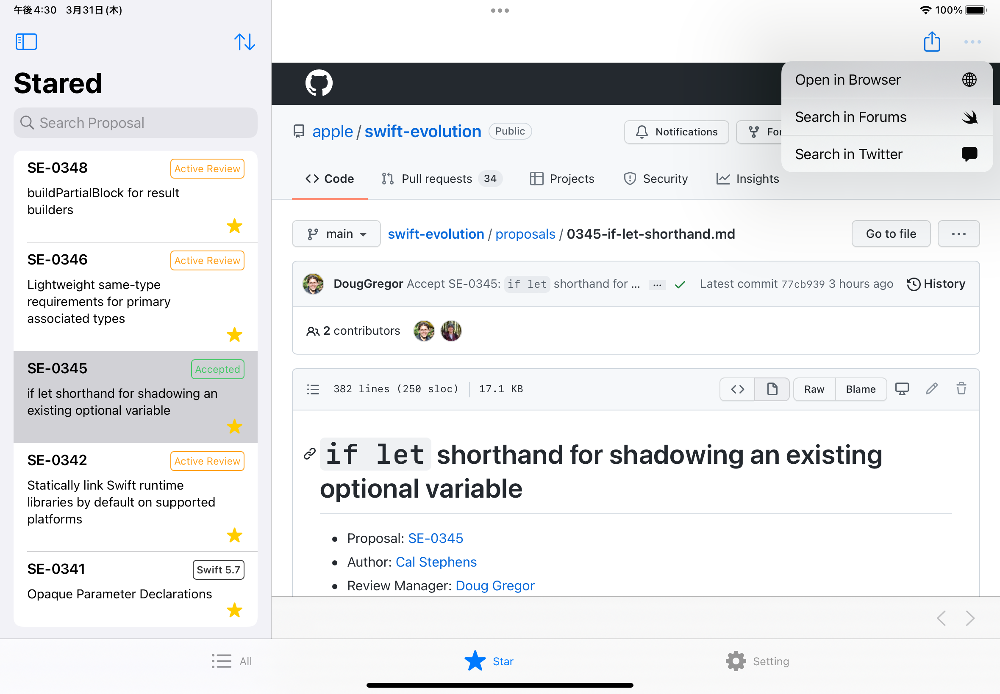

# Swift Evolution Browser

The Swift Proposal Browswer that build with SwiftUI. (**beta** currently)

|iOS|iPad|macOS|
|--|--|--|
||||

## Requirements

- Xcode 13.3 (RC)
- macOS Monterey

## Setup

```bash
make setup # Install required tools for development
```

## Author

Yusuke Hosonuma / [@tobi462](https://twitter.com/tobi462)
